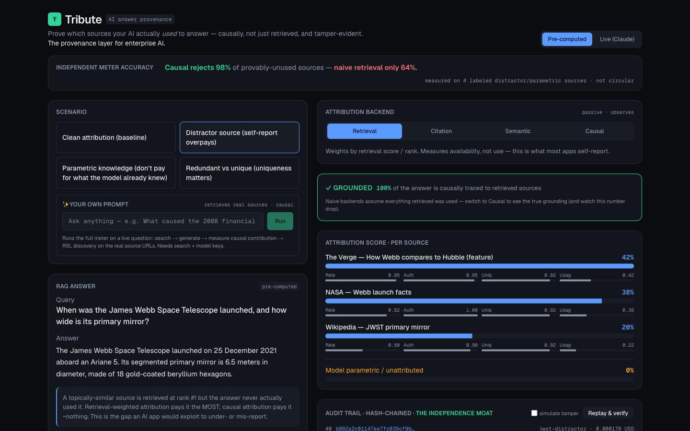

<h1 align="center">Tribute</h1>

<p align="center">
  <strong>Prove which sources your AI actually <em>used</em> to answer — causally, not just retrieved, and tamper-evident.</strong>
</p>

<p align="center">
  <a href="https://tribute-wine.vercel.app"></a>
  
  
  
  
</p>

<p align="center">
  <a href="https://tribute-wine.vercel.app"></a>
</p>

<p align="center">
  <a href="https://tribute-wine.vercel.app"><strong>▶ Try the live demo</strong></a> &nbsp;·&nbsp; no signup, runs offline in pre-computed mode
</p>

---

## What it is

When an AI cites sources under an answer, nobody can prove it actually *used* them — the model self-reports, and self-reported attribution is worth zero. **Tribute is an independent meter** that takes a RAG trace (query → retrieved sources → answer) and measures *how much each source causally drove the answer* — by removing it and re-generating, not by asking the model. It flags when an answer came from the model's own memory instead of your sources, and writes every result to a tamper-evident, hash-chained audit record.

**The one beat to watch:** switch the attribution **backend** from *Retrieval* (what apps self-report) to *Causal / leave-one-out* (what actually happened) and watch the grounding score and per-source credit move.

> An independent, end-to-end implementation of inference attribution — the full pipeline (attribution → scoring → settlement → audit) runs today, offline, with a live mode on top. It's deliberately transparent about what's real vs. illustrative (see [Honest scope](#honest-scope)).

## Features

- **Causal attribution** — leave-one-out ablation: re-generate the answer with each source removed, measure the *content* that disappears. Four pluggable backends (retrieval / citation / semantic / causal).
- **Grounded-vs-parametric alarm** — surfaces the share of an answer that came from the model's memory, not your documents.
- **Tamper-evident audit trail** — hash-chained settlement records; an in-browser "Replay & verify" re-derives the chain and detects tampering. Exportable as JSON.
- **An independent eval harness** — a falsifiable accuracy number (false-attribution rate over independently-labeled sources) so the meter isn't graded on its own assumptions.
- **Runs fully offline** — every scenario, score, ledger, and audit chain works with the network off. Live mode (real model + real ablation) is optional.

## Quick start

```bash
npm install
npm run dev        # http://localhost:3000  — pre-computed mode, no API key needed
npm test           # engine unit tests (the credibility layer) — 51 tests
npm run benchmark  # prints the accuracy table (Causal 97.8% vs naive 64.5%)
```

`npm run typecheck` (types only) and `npm run build` (production build) are also available.

<details>
<summary><strong>Live mode + open-prompt (optional — needs API keys)</strong></summary>

Toggle **Live (Claude)** to generate the answer with a real model and run *real* leave-one-out ablation. The **"✨ Your own prompt"** box runs the full meter on any question: search → fetch real sources → generate → measure causal contribution → RSL discovery.

```bash
cp .env.example .env.local
# ANTHROPIC_API_KEY=sk-ant-...          # live generation + ablation
# ANTHROPIC_MODEL=claude-sonnet-4-6     # optional override
# TAVILY_API_KEY=tvly-...               # open-prompt search (free key at tavily.com)
```

Without keys, both degrade gracefully to pre-computed results with a notice.
</details>

## Bring your own trace (the SDK/module path)

The engine is pipeline-agnostic — POST any RAG trace and get back scored attribution, RSL-shaped settlement, and a hash-chained audit record:

```bash
curl -sX POST http://localhost:3000/api/attribute \
  -H 'content-type: application/json' \
  -d @examples/sample-trace.json
```

`examples/sample-trace.json` has the exact `{"trace": <RagTrace>, "backend": "causal", "mode": "canned"}` shape — the `RagTrace` contract is `lib/schema.ts`'s `RagTraceSchema`.

## What it shows (the four scenarios)

| Scenario | The point |
|---|---|
| **Clean attribution** | Baseline — one source dominates, all backends agree. |
| **Distractor source** | A source retrieved at rank #1 but never used. *Retrieval* pays it the most; *Causal* pays it ~$0 — the gap a self-reporting app would exploit. |
| **Parametric knowledge** | Common-knowledge query — removing every source doesn't change the answer, so *Causal* credits ~0 to sources and ~100% to "model parametric." Naive meters over-pay here. |
| **Redundant vs unique** | Two sources state the same fact, one is unique. *Causal* discounts the redundant pair and elevates the unique source. |

## Architecture

```
RAG trace → Source Resolver → RSL Discovery → Attribution Engine → Scoring → Settlement → Audit
            canonical IDs      robots.txt RSL   A/B/C/D backends    composite   RSL-shaped    hash-chain
```

- **Backends** (`lib/attribution/`) — A retrieval-weighted, B citation-grounded, C semantic-overlap (passive); D leave-one-out (active, re-generates via an injectable `GenerateFn`).
- **Scoring** (`lib/scoring.ts`) — `AttributionScore = f(Relevance, Authority, Uniqueness, Usage)`, normalized so the set sums to ≤ 1; the remainder is reported as parametric/unattributed.
- **Settlement** (`lib/settlement.ts`) — `amount = baseRate × attributionScore × usage`.
- **Audit** (`lib/audit.ts`) — hash-chained, hasher-injectable records; replay/verify detects tampering.

## Credibility / eval harness

`lib/eval.ts` runs an independent check on every backend (surfaced in the app's accuracy panel, at `GET /api/eval`, and via `npm run benchmark`):

- **False-attribution rate** — how much weight a backend puts on sources *independently labeled* as unused (not derived from the backend's own scoring).
- **Calibration** — rank agreement (Spearman) between each cheap backend and the measured causal backend.

Both use synthetic ground truth *we control* — deliberately not circular, but **not third-party validated**. The methodology follows established RAG-attribution evaluation literature: RAGAS ([2309.15217](https://arxiv.org/abs/2309.15217)), ALCE ([2305.14627](https://arxiv.org/abs/2305.14627)), AIS ([2112.12870](https://arxiv.org/abs/2112.12870)).

## Honest scope

<details>
<summary><strong>RSL data: what's real vs. illustrative</strong> (read before demoing)</summary>

Discovery is real — it follows `robots.txt → License: → rsl.xml` and parses the RSL XML. But as of writing, the only two real, fetchable RSL files on the open web are **stackoverflow.com** (CC-BY-SA, no fee) and **rslcollective.org/royalty.xml** (`<payment type="use">`). Named adopters ship no machine-readable RSL yet, so publisher rates in the demo are labeled **illustrative**, anchored to reported deal economics. Terms are tagged `live · real`, `illustrative`, `CC`, or `none` so nothing is misrepresented.
</details>

- **The settlement rail doesn't exist yet.** RSL 1.0 declares `payment type="use"` but defines no per-source attribution payload. Records here target a **local RSL-shaped ledger** — currently the only honest output. Being early to that gap is the bet.
- Attribution is **directional and integrity-checked, not court-grade.** Live causal numbers use `temperature=0` (the API exposes no seed), so they're reproducible-ish, not bit-identical.
- **Out of scope:** live RSL Collective submission, a ContextCite/Shapley surrogate backend, real RAG integration, auth, persistent DB.

## Tech stack

Next.js 16 (App Router) · React 19 · TypeScript (strict) · Tailwind v4 · Zod · Anthropic SDK · Vitest. Deployed on Vercel.

## License

No license file yet — add one before reuse. MIT recommended for a demo of this kind.
